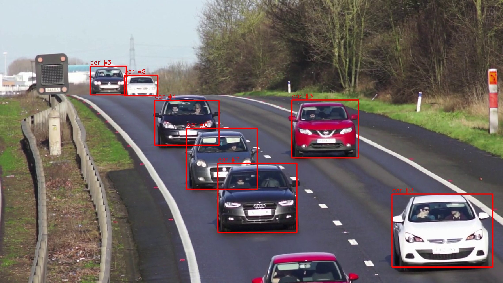

# Traffic Observer

Traffic Observer is a C++ video analytics system for vehicle detection and traffic monitoring.

The project processes video streams in real time using a multithreaded pipeline, detects vehicles with YOLO, tracks them across frames, counts line-crossing events, and publishes analytics events via MQTT.

## Features

- Video ingest using OpenCV
- Multithreaded processing pipeline
- Thread-safe bounded queues
- YOLO-based vehicle detection
- Non-Maximum Suppression (NMS)
- Vehicle tracking with persistent IDs
- Line-crossing vehicle counting
- MQTT event publishing
- Overlay visualization:
  - Bounding boxes
  - Vehicle class labels
  - Tracking IDs

## Architecture

```text
Video Reader
     │
     ▼
YOLO Detector
     │
     ▼
Tracker
     │
     ▼
Vehicle Counter
     │
     ├── MQTT Publisher
     │
     ▼
Display Output
```

## Technologies

* C++20
* OpenCV
* Boost.Log
* Eclipse Paho MQTT C++
* CMake
* Multithreading (`std::thread`)
* Smart pointers (`std::unique_ptr`, `std::shared_ptr`)

## Project Structure

```text
src/
├── core/
│   ├── types/
│   ├── pipeline/
│   └── utils/
├── analytics/
├── logger/
├── messaging/
│   └── mqtt/
├── processors/
│   ├── grayscale/
│   ├── motion/
│   └── yolo/
├── services/
│   └── video_ingest/
├── trackers/
└── outputs/
```

## Build

### Dependencies

Ubuntu:

```bash
sudo apt install \
    build-essential \
    cmake \
    libopencv-dev \
    libboost-log-dev \
    libpaho-mqtt-dev \
    libpaho-mqttpp-dev
```

### Compile

```bash
git clone <repository-url>
cd TrafficObserver

mkdir .build
cd .build

cmake ..
make -j
```

## Running

Place YOLO configuration, weights, and class files into the `models/` directory.

Example:

```text
models/
├── yolov4-tiny.cfg
├── yolov4-tiny.weights
└── coco.names
```

Run:

The application expects a video file as a command-line argument.

Example:

```bash
./TrafficObserver path/to/video.mp4

## MQTT Events

When a vehicle crosses the counting line, the application publishes an event:

```json
{
  "event": "vehicle_crossed",
  "track_id": 17,
  "vehicle_type": "car"
}
```

Default topic:

```text
traffic/events
```

To inspect events locally:

```bash
mosquitto_sub -t traffic/events
```

## Current Capabilities

* Vehicle detection
* Vehicle tracking
* Vehicle counting
* Event generation
* Real-time visualization

## Demo

Example output:

* Vehicle detection with YOLO
* Bounding boxes and labels
* Persistent tracking IDs



* Vehicle counting based on line crossing
* MQTT event generation

```

{"event":"vehicle_crossed","track_id":1,"vehicle_type":"car"}
{"event":"vehicle_crossed","track_id":0,"vehicle_type":"car"}
{"event":"vehicle_crossed","track_id":7,"vehicle_type":"car"}
{"event":"vehicle_crossed","track_id":6,"vehicle_type":"car"}
{"event":"vehicle_crossed","track_id":3,"vehicle_type":"car"}
{"event":"vehicle_crossed","track_id":4,"vehicle_type":"car"}


```
